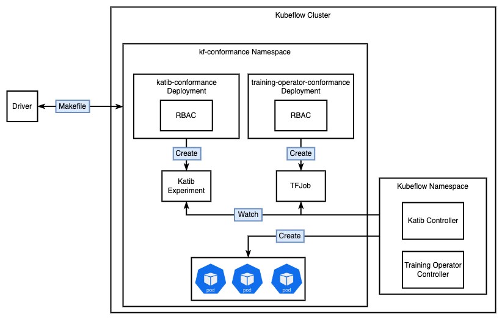

# Conformance Test for AutoML and Training Working Group

Andrey Velichkevich ([@andreyvelich](https://github.com/andreyvelich))
Johnu George ([@johnugeorge](https://github.com/johnugeorge))
2022-11-21
[Original Google Doc](https://docs.google.com/document/d/1TRUKUY1zCCMdgF-nJ7QtzRwifsoQop0V8UnRo-GWlpI/edit#).

## Motivation

Kubeflow community needs to design conformance program so the distributions can
become
[Certified Kubeflow](https://docs.google.com/document/d/1a9ufoe_6DB1eSjpE9eK5nRBoH3ItoSkbPfxRA0AjPIc/edit?resourcekey=0-IRtbQzWfw5L_geRJ7F7GWQ#).
Recently, Kubeflow Pipelines Working Group (WG) implemented the first version of
[their conformance tests](https://github.com/kubeflow/kubeflow/issues/6485).
We should design the same program for AutoML and Training WG.

This document is based on the original proposal for
[the Kubeflow Pipelines conformance program](https://docs.google.com/document/d/1_til1HkVBFQ1wCgyUpWuMlKRYI4zP1YPmNxr75mzcps/edit#).

## Objective

Conformance program for AutoML and Training WG should follow the same goals as Pipelines program:

- The tests should be fully automated and executable by anyone who has public
  access to the Kubeflow repository.
- The test results should be easy to verify by the Kubeflow Conformance Committee.
- The tests should not depend on cloud provider (e.g. AWS or GCP).
- The tests should cover basic functionality of Katib and the Training Operator.
  It will not cover all features.
- The tests are expected to evolve in the future versions.
- The tests should have a well documented and short list of set-up requirements.
- The tests should install and complete in a relatively short period of time
  with suggested minimum infrastructure requirements
  (e.g. 3 nodes, 24 vCPU, 64 GB RAM, 500 GB Disk).

## Kubeflow Conformance

Initially the Kubeflow conformance will include the CRD based tests.
In the future, API and UI based tests may be added. Kubeflow conformance consists
the 3 category of tests:

- CRD-based tests

  Most of Katib and Training Operator functionality are based on Kubernetes CRD.

  **This document will define a design for CRD-based tests for Katib and the Training Operator.**

- API-based tests

  Currently, Katib or Training Operator doesn’t have an API server that receives
  requests from the users. However, Katib has the DB Manager component that is
  responsible for writing/reading ML Training metrics.

  In the following versions, we should design conformance program for the
  Katib API-based tests.

- UI-based tests

  UI tests are valuable but complex to design, document and execute. In the following
  versions, we should design conformance program for the Katib UI-based tests.

## Design for the CRD-based tests



The design is similar to the KFP conformance program for the API-based tests.

For Katib, tests will be based on
[the `run-e2e-experiment.go` script](https://github.com/kubeflow/katib/blob/570a3e68fff7b963889692d54ee1577fbf65e2ef/test/e2e/v1beta1/hack/gh-actions/run-e2e-experiment.go)
that we run for our e2e tests.

This script will be converted to use Katib SDK. Tracking issue: https://github.com/kubeflow/katib/issues/2024.

For the Training Operator, tests will be based on [the SDK e2e test.](https://github.com/kubeflow/training-operator/tree/05badc6ee8a071400efe9019d8d60fc242818589/sdk/python/test/e2e)

### Test Workflow

All tests will be run in the _kf-conformance_ namespace inside the separate container.
That will help to avoid environment variance and improve fault tolerance. Driver is required to trigger the deployment and download the results.

- We are going to use
  [the unified Makefile](https://github.com/kubeflow/kubeflow/blob/2fa0d3665234125aeb8cebe8fe44f0a5a50791c5/conformance/1.5/Makefile)
  for all Kubeflow conformance tests. Distributions (_driver_ on the diagram)
  need to run the following Makefile commands:

  ```makefile

  # Run the conformance program.
  run: setup run-katib run-training-operator

  # Sets up the Kubernetes resources (Kubeflow Profile, RBAC) that needs to run the test.
  # Create temporary folder for the conformance report.
  setup:
    kubectl apply -f ./setup.yaml
    mkdir -p /tmp/kf-conformance

  # Create deployment and run the e2e tests for Katib and Training Operator.
  run-katib:
    kubectl apply -f ./katib-conformance.yaml

  run-training-operator:
    kubectl apply -f ./training-operator-conformance.yaml

  # Download the test deployment results to create PR for the Kubeflow Conformance Committee.
  report:
    ./report-conformance.sh

  # Cleans up created resources and directories.
  cleanup:
    kubectl delete -f ./setup.yaml
    kubectl delete -f ./katib-conformance.yaml
    kubectl delete -f ./training-operator-conformance.yaml
    rm -rf /tmp/kf-conformance
  ```

- Katib and Training Operator conformance deployment will have the appropriate
  RBAC to Create/Read/Delete Katib Experiment and Training Operator Jobs in the
  _kf-conformance_ namespace.

- Distribution should have access to the internet to download the training datasets
  (e.g. MNIST) while running the tests.

- When the job is finished, the script generates output.

  For Katib Experiment the output should be as follows:

  ```
  Test 1 - passed.
  Experiment name: random-search
  Experiment status: Experiment has succeeded because max trial count has reached
  ```

  For Training Operator the output should be as follows:

  ```
  Test 1 - passed.
  TFJob name: tfjob-mnist
  TFJob status: TFJob tfjob-mnist is successfully completed.
  ```

- The above report can be downloaded from the test deployment by running `make report`.

- When all reports have been collected, the distributions are going to create PR
  to publish the reports and to update the appropriate [Kubeflow Documentation](https://www.kubeflow.org/)
  on conformant Kubeflow distributions. The Kubeflow Conformance Committee will
  verify it and make the distribution
  [Certified Kubeflow](https://github.com/kubeflow/community/blob/master/proposals/kubeflow-conformance-program-proposal.md#overview).
